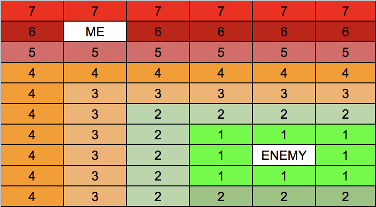
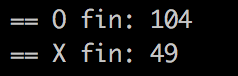

# Filler
Filler is another project inside the Algorithms and A.I. branch at 42 School Silicon Valley. In this project I was given the task to create a autonomous player to a simple board game, which is "Filler". Filler is a game in which there are 2 players who are suposed to place random pieces inside the board, and the player which covers more area of the board wins. The fun part of the game is that you are only allowed to place a piece if it is touching with only one part of the piece your previously owned area. So in this case the game is no only about putting the pieces in the most efficient way, but to place them in a way that discomforts the enemy player.

## My Approach
This project was diferent to all the previous algorithms projects I have made because in this one there is not only constants in the algortihm. In this activity your parameters are always changing: The map is being filled by the enemy, so you don't know the next move right away and also the pieces you are given are always diferent in size and shape. This is why the algorithm of this project should be able to handle the variables given and then place your given piece in the best way posible. The way I solved the puzzle was to create a heatmap of how the pieces are arranged, in this way the spaces near the enemy have a lower value which makes my auto-player able to calculate the best piece placement. My strategy for this game is to block the enemy first and then fill the rest of the board. To do so I followed the next steps:



#### 1. Get my player
In this project we are given a virtual machine which will handle the players and the map, so the first step is to read the input from the virtual machine and parsed it into a readable format for my program. After that we pick the character that will represent my player based on the values given.

#### 2. Get map
As I said before the variable can change in the game so that is why in this algorithm, it first reads the dimensions of the board and then fills a 2-Dimensional array with the pieces given.

#### 3. Create the Heatmap
After the board is filled, it will create another 2D array, which will be filled with integers. THe filling of the heatmap starts by checking all the squares adjacent to the enemy and assigning it the value of 1. After that we fill the rest of the map with the next integer, until we meet the end of it.

#### 4. Piece recognition
After creating the heatmap we read the piece and convert it into a 2D char array, but that is only temporary because I then convert it into a linked list of pieces of the piece by getting their coordinates in relation to the origin of the piece map. This is really helpful for the solving part.

#### 5. Solving
The algorith to solve is really simple, I go throughout the whole board and check position by position if the piece could be placed in that position and what would be the addition of the values of the parts of the piece in the heatmap. If the piece is in a valid position and the score is less than the previous one it means that the piece is closer to the enemy, therefore better placed for our strategy, so I save that coordinate and continue. Once all the board has been checked we simply print the best coordinate and wait for the map update. 

## Prerequesites
For this project the prerequesite is to have the virtual machine given, which is included in this repo inside the resources directory.

## Installing and running
1. As always the first step is to clone the repo and going into the directory cloned
```
git clone https://github.com/JuanCasian/42-Filler.git
cd 42-Filler
```
2. Make the filler player, which will be added to the ./resources/players/ folder
```
make
```
3. Go into the resources folder and run the virtual machine with my player (jcasian.filler), below are some examples of how to run it:
```
./filler_vm -f maps/map02 -p1 players/hcao.filler -p2 ../jcasian.filler
./filler_vm -f maps/map00 -p1 ../jcasian.filler -p2 players/hcao.filler
```
After running the program the result is presented, O is por player 1 and X is for player 2:


## Author
Juan Pedro Casian - Github: [@JuanCasian](https://github.com/JuanCasian) - Email: juanpedrocasian@gmail.com
